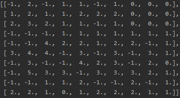
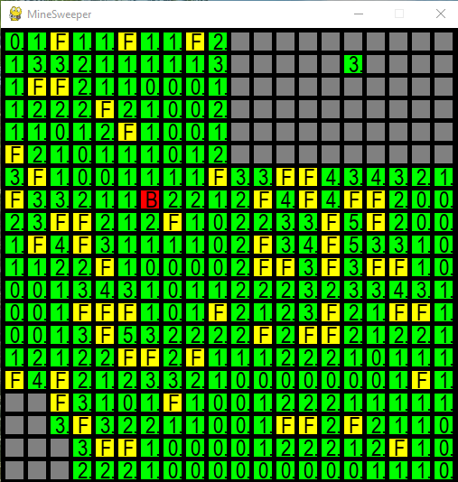
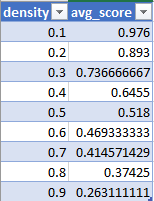
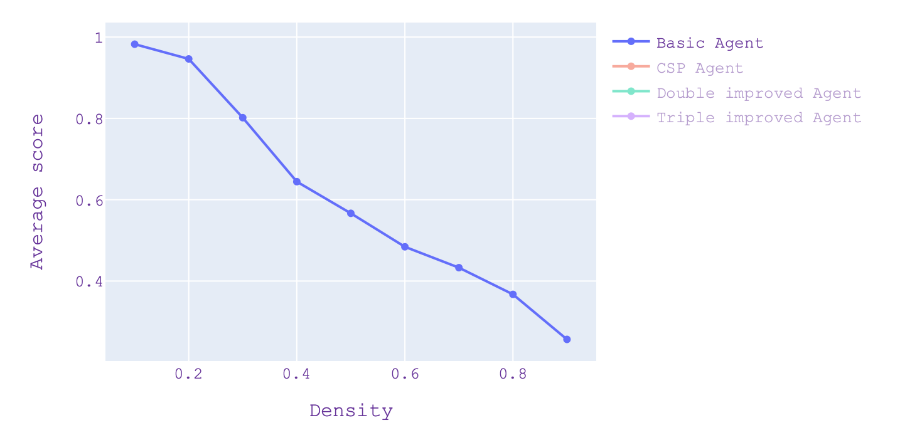
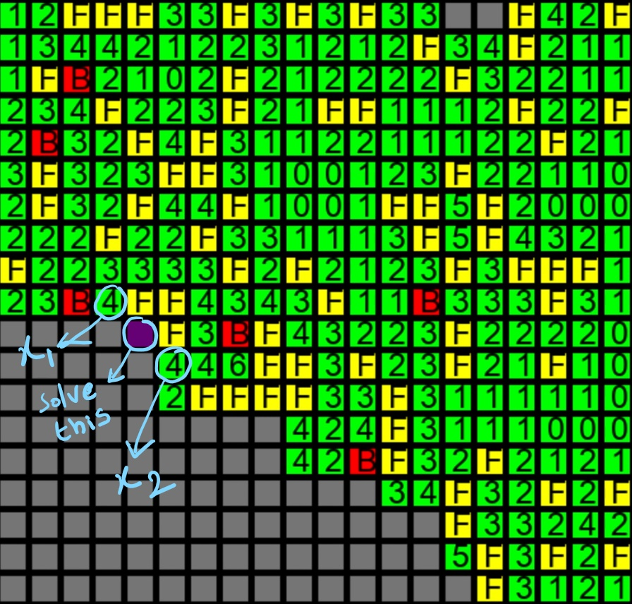
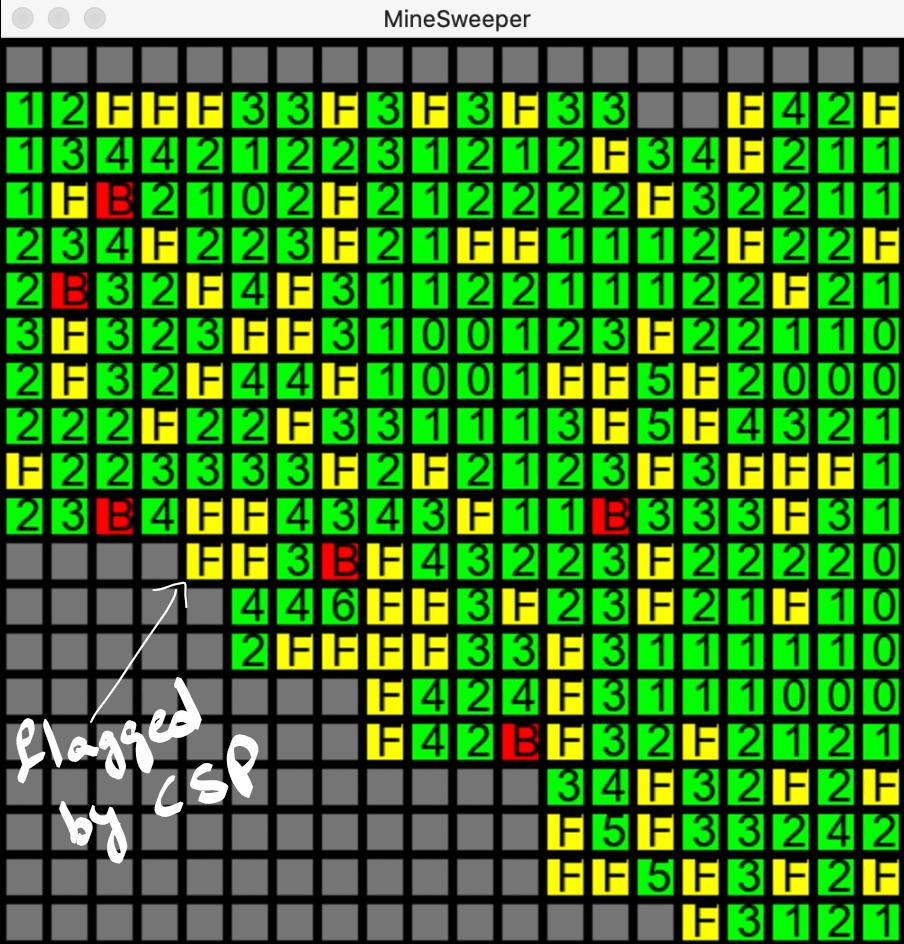

Creating Environment for Minesweeper
====================================

An Environment class is created which is common for all the agents. This
class takes the mine density and the dimensions of grid as
initialization parameters. With the given parameters, a grid is created
with *density* $\times$ ${dimension}^2$ number of mines. This is stored
in a grid variable and is private to the environment. After creating
mines, cells are populated with the number corresponding to number of
neighbouring mines. A *query\_cell* method is exposed which takes input
a cell and returns it's value. If the cell is a mine, it is flagged as
one. Otherwise, value of the respective cell is assigned to it. This is
how a sample Environment internal grid looks like. It is represented as
basic 2 $\times$ 2 matrix. Here -1 represents a mine and remaining cells
represent respective number of mines surrounding.

{#fig}

A Cell class is created to store all the required cell attributes.

``` {.python language="Python"}
class Cell:
    def __init__(self, row, col):
        self.row = row
        self.col = col
        self.is_mine = False
        self.is_flagged = False
        self.curr_value = None
        self.mines_surrounding = None
        self.safe_cells_surr = None
        self.covered_neighbours = None
        self.total_neighbours = None
        self.probability = None
```

Attributes described below

1.  Row: Row number of cell in grid

2.  Col: Column number of cell in grid

3.  is\_mine: Flagged by Environment if mine is opened

4.  is\_flagged: Flagged by Agent if mine is identified

5.  curr\_value: Current value determined after opening a safe cell

6.  mines\_surrounding: Number of mines(including flagged ones)
    surrounding the Cell

7.  safe\_cells\_surr: Number of Safe Cells surrounding the Cell

8.  covered\_neighbours: Number of neighbours yet to be opened

9.  total\_neighbours: Total number of neighbours available for a Cell.
    Useful for cells in edges of grid

10. Probability: The probability of cell being a mine based on the
    knowledge base we have until that point.

Representation of Minesweeper in Agent's perspective
====================================================

We used *PyGame* for representing the Minesweeper instance. For every
agent solving the Minesweeper, he will have a current state until which
grid is solved. This will be given to *pygame* and represented using a
graphical grid with colors. Below is one instance of Basic Agent solving
the Minesweeper with mine density 0.2 and dimension 20 $\times$ 20

-   Green color represents safe cells which can be opened instantly

-   Yellow represents flagged cells which are determined as Mines by
    Agent. Yellow cells will have *F* written on it representing flagged
    cell

-   Red color with *B* in it represents a cell which is opened by agent
    but turned out to be a *mine*

-   Grey colored cells are yet to be opened/flagged

{#fig}

Basic Agent
===========

*Basic Agent solves one cell at a time*. Every agent will have a grid
instance of it's own different from the the environment. This is the
agent's perspective. This grid will contain cell objects with all the
attributes populated every time new information is available. Basic
Agent loops through all the available cells looking for the below
conditions to be satisfied.

-   If, for a given cell, the total number of mines (the clue) minus the
    number of revealed mines is the number of hidden neighbors, every
    hidden neighbor is a mine.

-   If, for a given cell, the total number of safe neighbors (total
    neighbours - clue) minus the number of revealed safe neighbors is
    the number of hidden neighbors, every hidden neighbor is safe.

If any of the above condition is met for a cell, agent opens all the
neighbours if deemed safe or flags all neighbours if deemed unsafe.

{#fig}

{#fig}

This is plotted in next section

{#fig}

Improved Agent - CSP
====================

The representation of it is similar to that of the basic agent.

In Basic agent we look at one cell at a time and move forward based on
single instance, there will be many situations where we can draw more
inferences about the board increasing agent's efficiency. *An improved
agent over basic agent could be using Constraint Satisfaction
Problem(CSP) heuristic*, where we maintain a knowledge base with the
inferences from revealed cells. CSP agents works as follows.

-   Initially whenever a cell is revealed and it's not a mine we
    generate condition based on the revealed number.

-   All these conditions are stored in a knowledge base which is later
    used for inferences.

-   We randomly select a cell in knowledge base and assign a value in
    the domain and iterate the assignment on all the conditions and if
    the knowledge base breaks because the assignment then we can say
    that the contrary is true.

-   Based on this we identify safe and mine cells. We reveal next cell
    from marked safe cells and flag mines.

When we can't infer any safe cells from the knowledge base then we
randomly choose a non-flagged and non-mine cell.

Metrics of CSP agent working on a 20\*20 maze with different mine
densities.

{#fig}

The performance metrics is within our intuitive observation although
there is no huge difference between naive and CSP agent. Since we are
maintaining a knowledge base here, dealing with grids over 45 \* 45 is
taking considerable about of time due it's high space and time
complexity. As we can see CSP agent out performs basic agent when the
mine density is between 0.2 and 0.7. As the size of the maze increases
it becomes hard for the CSP agent to play.

CSP in Action
-------------

Here we can see in Figure 7, cell marked in blue is being solved. In
below diagram, x1 has two neighbours as mines and three covered cells.
Basic agent can't do anything here. Same goes with x2. CSP *fake-marked*
it as safe in duplicate knowledge base. When we flag target cell as
safe, other two neighbours of x1 should be mines. If they are mines, two
cells in the left most have to be safe as the cell with 3 will have
covered all mines. This leads to a contradiction for the left most
cell(the one with 2 marked on it) leaving only one mine where in-fact
there should be two. Here the pseudo knowledge base is broken. So CSP
determines that the target cell is in fact a mine.

{#fig}

{#fig}

Logic in Code Walk-through
--------------------------

-   Knowledge base is represented as a list of equations. Each equations
    is a list with cells in first part and value in second part.

-   CSP agent can either flag a cell or mark a cell as safe. These are
    the clues determined by the *contradiction* logic. When a random
    cell is opened, this is a clue given by the environment. Whenever a
    new clue is collected, it is added to the knowledge-base i.e an
    equation is created.

    -   When a random cell turns out to be a mine or when *CSP*
        contradiction flags it as mine, it is flagged and added to
        explored cells list. All the equations in Knowledge-base will be
        substituted with this value i.e flagged cell will be removed and
        value of equation will be reduced by 1

    -   When a safe cell is encountered by CSP, it will be stored in a
        list of safe cells which will be opened instead of random cells.
        Immediately, this cell will be removed from knowledge base
        equations wherever present

Double Improved Agent - Probabilistic Choosing
==============================================

The representation of it is similar to that of the CSP agent.

When the CSP agent cannot infer anything from the current knowledge
base, it randomly opens a cell from the unexplored cells. The double
improved agent will choose a cell having a minimum probability of it
being a mine. This probability of each cell being a mine is calculated
in the following way.

-   Initially self.probability for all the cells is None.

-   Consider the cell being a mine, find the total number of possible
    arrangements satisfying the constraint equations in the knowledge
    base at that instance.

-   We repeat the process by considering the cell not being a mine and
    find all the possible arrangements.

-   The probability of the cell being a mine is: (Total number of
    possibilities when cell is a mine) / (Sum of total number of
    possibilities when the cell is not a mine and total number of
    possibilities when the cell is a mine)

We flag the cell as mine if the probability is 1 and mark the cell as
safe if the probability is 0 and update this information in our
knowledge base. The program did not make any decision which surprised us
because it was choosing a cell having minimum probability from the
unexplored cells.

Metrics of Double improved agent working on a 20\*20 maze with different
mine densities.

{#fig}

The performance metrics is within our intuitive observation. Since we
are maintaining a knowledge base here, dealing with grids over 40 \* 40
is taking huge time due it's high space and time complexity. As we can
see Double Improved agent out performs CSP and basic agent when the mine
density is greater than 0.2. As the size of the maze increases it
becomes hard for the Double Improved agent to play.

Triple Improved Agent - Break the tie with max
==============================================

On of the problems that we face in probabilistic choosing is that when
there are multiple cells with equal minimal probabilities, we choose a
random cell among the minimal probability cells. In such scenarios the
triple improved agent chooses a cell which is present in the more
constrain equations of the knowledge base. The reason for taking such a
decision is because when we reveal a cell which is present in more
constrain equations of the knowledge base, it would give us more
information of the other cells moving forward (information gain in
revealing that cell would be higher).

Metrics of Triple improved agent working on a 20\*20 maze with different
mine densities.

{#fig}

The performance metrics is within our intuitive observation. As
projected in graphs Triple Improved agent out performs other agents with
all mine densities. As the size of the maze increases it becomes hard
for the agent to play.

Contributions {#contributions .unnumbered}
=============

-   Aravinda: Environment coding, Basic Agent, CSP Agent, Visualization
    of maze using *Pygame*. Documenting these parts

-   Rithvik: Double improved agent, documenting the questions and write
    up part.

-   Kaavya: CSP Agent, Triple Improved Agent and documentation related
    to it.

Acknowledgment {#acknowledgment .unnumbered}
==============

We would like to thank Professor Cowan W. Charles and fellow students
who have clarified doubts on the discussion board and helped us
understand the problem statement better.

1

Class notes Discussion board on Canvas.
